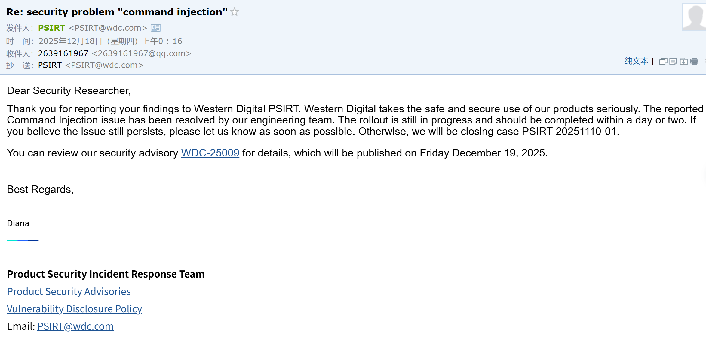
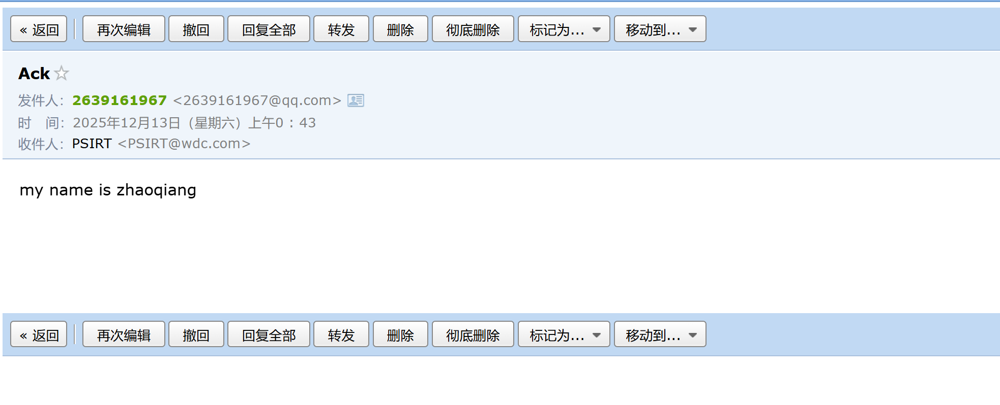
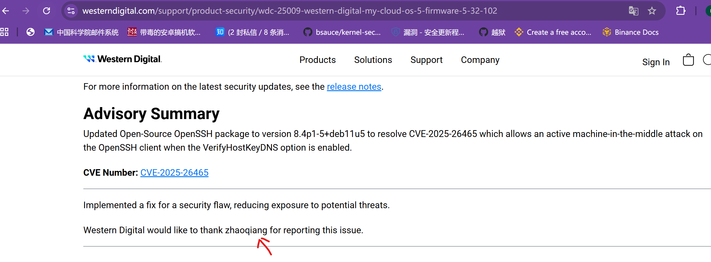

product **My Cloud PR4100**

url https://support-en.wd.com/app/products/product-detailweb/p/139

Version: Firmware Release 5.31.108

**Firmware download**: 

https://updates.mycloud.com/os5/prod/5.31.108/WDMyCloudPR4100_5.31.108_prod.binin 

In /cgi/network_mgr.cgi file 

There are two functions , which don't use "cgi_escapeshellarg()" function to escape command injection. maybe cause **arbitrary command Execution**

The attacker can use the following command to **cat some file**, or **write shell commmads word by word**. Any of their length are not biger than 16 bytes.

modify:

https://www.westerndigital.com/support/product-security/wdc-25009-western-digital-my-cloud-os-5-firmware-5-32-102
