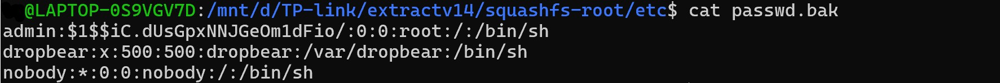
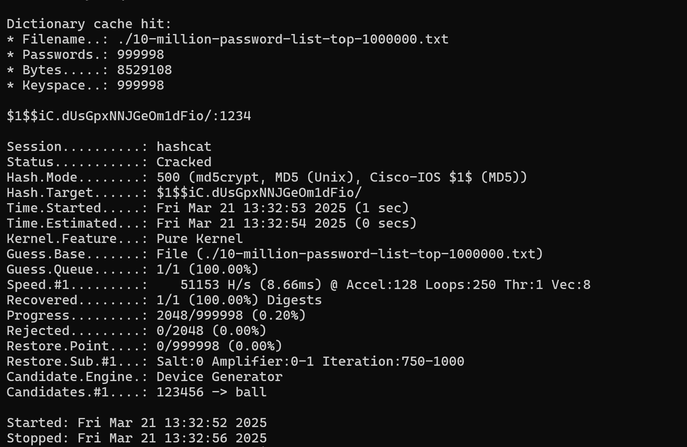

Make: TP-Link 

Model: TL-WR841N  V14

This vulnerability is about revealing the "root-shell credentials" present in the firmware of TLWR845N router. The firmware can be extracted through two methods: SPI Flash memory and manufacturer’s public repository 

(https://www.tp-link.com/zh-hk/support/download/tl-wr841n/#Firmware). 

After extracting the firmware, we can use tools like binwalk or FirmAudit (our tool) to extract the files. The MD-5 hashed password is stored in the "squashfs-root/etc/passwd" and "squashfsroot/etc/passwd.bak" files. The hashed root password can be easily cracked to reveal it as "1234" while the root username is in plain-text i.e. "admin". 

This vulnerability is present in all the firmware versions (TL-WR841N(US)_V14_231119 ) available on the official website of the manufacturer and can be exploited since it gives access to the root user privilege.

